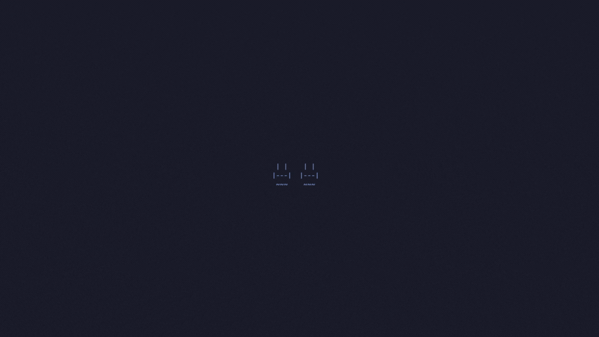

# WELCOME TO ASCIIROIDS

## One Player


## Multiplayer



## How to Run

Run the game using the following commands (--vim for vim mode, --multi for multiplayer mode)

```
go run .
go run . --vim
go run . --multi
```

## Controls

### Player 1 (Normal)

- `w`: Up
- `a`: Left
- `s`: Down
- `d`: Right
- `space`: Shoot

### Player 1 (Vim)

- `h`: Left 
- `j`: Down
- `k`: Up
- `l`: Right
- `s`: Up-Left
- `d`: Down-Left
- `f`: Down-Right
- `g`: Up-Right
- `space`: Shoot 

### Player 2

- `↑`: Up
- `↓`: Down
- `←`: Left
- `→`: Right
- `enter`: Shoot
